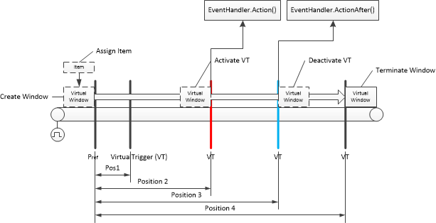

# Window Tracking

## Description
In many automation applications items will be transported on a transport route through a machine. During the transport it's necessary to track the item position to execute some actions on specific positions. This library provide some support for position tracking on a transport route (e.g. a conveyor). 

The sketch below shows the main objects of that solution. The main objects are:

- VirtualWindow
- VirtualWindowList
- VirtualTrigger
- VirtualTriggerList
- EventHandler
- Item

The `VirtualWindowList` can create new Virtual Windows and is responsible for managing the virtual windows.

Each `VirtualWindow` has a position within the transport route relative to the Reference point. When the item will be transported, the position will be updated cyclically.

When a `VirtualWindow` reaches a `VirtualTrigger` then then the VirtualTrigger will be activated. And if an EventHandler `ITriggerevent` is configured, the method `Action` of the event handler will be called.

When a `VirtualWindow` leaves a `VirtualTrigger` then then the VirtualTrigger will be deactivated. And if an EventHandler `ITriggerevent` is configured, the method `ActionAfter` of the event handler will be called.

If the `VirtualWindow` reaches the end of the transport route, it must by terminated by the application. 




Objects:


## Install this package

Enter:
```cli
apax add @simatic-ax/windowtracking
```
> to install this package you need to login into the GitHub registry. You'll find more information [here](https://github.com/simatic-ax/.sharedstuff/blob/main/doc/personalaccesstoken.md) 


## Namespace
```
Simatic.Ax.WindowTracking;
```

## VirtualTriggerList
### Definition

```iecst
NAMESPACE Simatic.Ax.WindowTracking.Trigger
    CLASS VirtualTriggerList IMPLEMENTS ITriggerList
        VAR PUBLIC
            PositiveTolerance : DINT := 5;
            NegativeTolerance : DINT := 5;
        END_VAR
    END_CLASS
END_NAMESPACE
```
### Public Interface
|||
|-|-|
|Add(tp : IVirtualTrigger): BOOL | Add an Element of `IVirtualTrigger` to the list. Returns `TRUE` when it was successful. |
|Count : UINT | Returns the number of `IVirtualTrigger` in the `VirtualTriggerList` |
|GetTriggerPoint(Id :UINT) | Returns an element `IVirtualTrigger` with the Id. Returns `NULL` if the Id was not found in the list |
| Check(tw : ITransportWindow) : BOOL | Check if the TransportWindow tw is in the range of any `IVirtualTrigger` in the list. Returns `TRUE` the TransportWindow has checked all `IVirtualTrigger`. `FALSE` when there are no `IVirtualTrigger` in the list.|
## VirtualTrigger
### Definition

The class `VirtualTrigger` will be activated when a virtual TransportWindow
### Definition

```iecst
NAMESPACE Simatic.Ax.WindowTracking.Trigger
    CLASS VirtualTrigger IMPLEMENTS IVirtualTrigger

        VAR PUBLIC
            Position : DINT;
            Id : UINT;
            EventHandler : ITriggerEvent;
            PositiveTolerance : DINT := -1;
            NegativeTolerance : DINT := -1;            
        END_VAR 
    END_CLASS
END_NAMESPACE
```

### Public Interface

|||
|-|-|
|ActivateEvent(tw : ITransportWindow)   | When the virtual window reaches the virtual trigger point, this method will be called. If an `EventHandler : ITriggerEvent` is configured, the `EventHandler.Action(IVirtualTrigger, ITransportWindow)`  method will be called. When the `IsActivated()` method returns `FALSE`, it will not executed|
|IsActivated() : BOOL                   | Returns `TRUE` when the VirtualTrigger is active window has reached the trigger point|
|GetID() : UINT                         | Returns the Id of the VirtualTrigger |
|GetPosition() : DINT                   | Returns the configured position of the VirtualTrigger |
|IsEnabled() : BOOL                   | Returns `TRUE` when the VirtualTrigger is enabled (default `TRUE`)|
| Check(tw : ITransportWindow, ul : DINT, ll : DINT) : BOOL | Returns `TRUE` (One Shot) when the TransportWindow tw is in the range of the VirtualTrigger position. 

### VAR PUBLIC Interface
|||
|-|-|
|Id : UINT          | Identifier of the VirtualTrigger (you've to take care that it is unique)|
|Position : DINT    | Position of the VirtualTrigger absolute to the reference point. Resolution depends on the encoder resolution |
| EventHandler : ITriggerEvent | The EventHandler which will be executed, when the VirtualTrigger is activated |
| PositiveTolerance : DINT := -1 | Individual positive tolerance for this VirtualTrigger if it's <> -1. When it is equal to -1, then the global tolerance from the TriggerPointList will be used |
| NegativeTolerance : DINT := -1 | Individual positive tolerance for this VirtualTrigger if it's <> -1. When it is equal to -1, then the global tolerance from the TriggerPointList will be used |

### Example Configuration
```iec-st
USING Simatic.Ax.WindowTracking.Trigger;
USING Simatic.Ax.WindowTracking.EventHandler;

VAR_GLOBAL
    eventHandler : ITriggerEvent;
    trig01 : VirtualTrigger := (ID := UINT#101, Position := 2000, [PositiveTolerance := 50,] [NegativeTolerance := 50,] EventHandler := eventHandler);
END_VAR
```


## Contribution

Thanks for your interest in contributing. Anybody is free to report bugs, unclear documentation, and other problems regarding this repository in the Issues section or, even better, is free to propose any changes to this repository using Merge Requests.

## License and Legal information

Please read the [Legal information](LICENSE.md)
