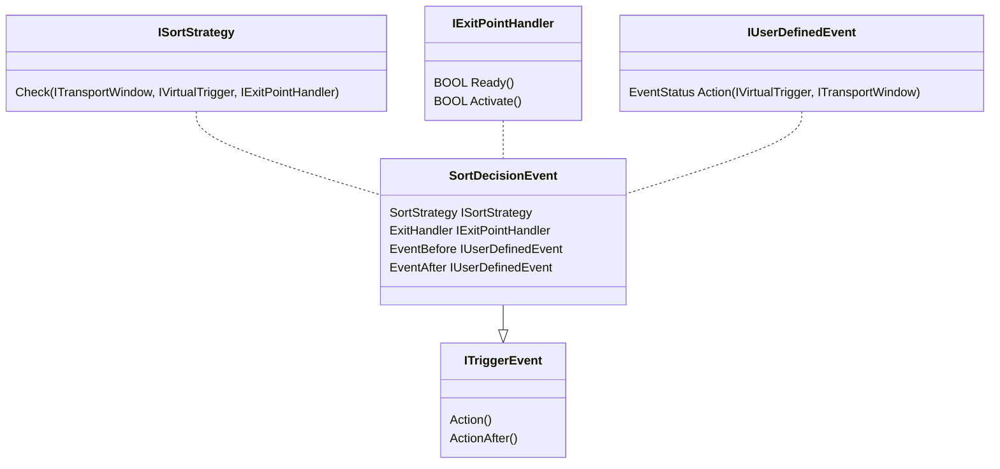

# SortDecisionEvent

## Description
A `SortDecisionEvent` is a predefined `ITriggerEvent` that can be used specifically 
to handle route decisions. Whenever a window passes a virtual trigger (trigger point) 
that has a `SortDecisionEvent`, it is checked whether the item should trigger an 
action of the `ExitHandler` at this trigger point.
Further more before and after the EventHandler, User defined (`IUserDefinedEvent`) events can be executed.

## Public interface:
|||
|-|-|
| SortStrategy : ISortStrategy; | Checks whether an action should be triggered for the item at this trigger point |
|ExitHandler : IExitPointHandler;|  Action() of the IExitPointHandler is executed when SortStrategy.Check() returns TRUE|
|EventBefore : IUserDefinedEvent;|  Userdefined event which is called before the Action() of the IExitPointHandler is called |
|EventAfter : IUserDefinedEvent; | Userdefined event which is called after the Action() of the IExitPointHandler is called |

## Class diagramm
